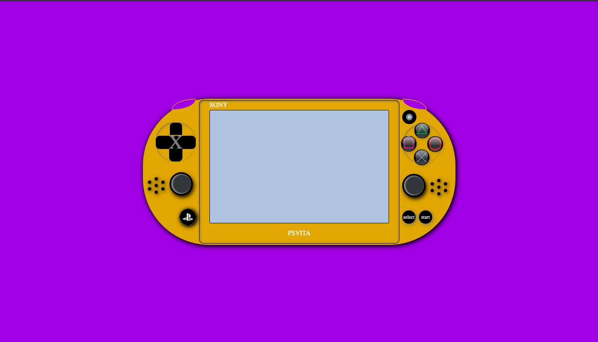

# First Project - Video Game Console

In this very first project at GeeksHubs Academy, our task is to recreate a Video Game Console with HTML and CSS.
The layout design that was used to make this project viable, was FlexBox.

Click [here](https://guillermoraez.github.io/Proyecto-1---Videoconsola-con-CSS/) to see the final result.
